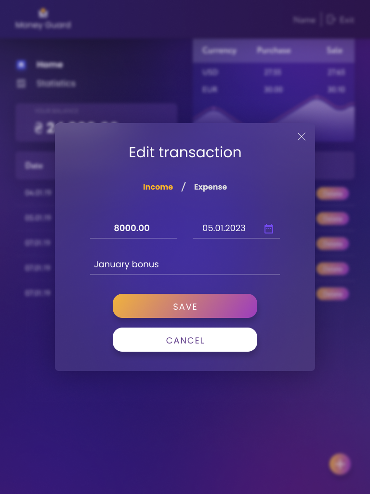
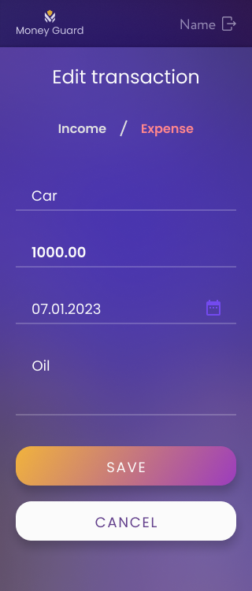

<h1>💰 MONEY GUARD — Personal Finance Management App</h1>

<em>A modern, responsive expense tracking application built with React & Redux.</em>

  <strong>Money Guard</strong> is a fully responsive financial management application 
  developed as a collaborative team project.
  The application allows users to securely register, log in, manage income and expense transactions,
  track total balance in real time, analyze statistics, and monitor exchange rates.

<h2>🌐 Live Demo</h2>

  👉 <strong>Coming Soon / Deployed Version Link Here</strong>

<h2>📋 Table of Contents</h2>
<ol>
  <li><a href="#about-the-project">About the Project</a></li>
  <li><a href="#core-features">Core Features</a></li>
  <li><a href="#technical-architecture">Technical Architecture</a></li>
  <li><a href="#project-structure">Project Structure</a></li>
  <li><a href="#technologies-used">Technologies Used</a></li>
  <li><a href="#team-members">Team Members & Responsibilities</a></li>
  <li><a href="#workflow-strategy">Workflow Strategy</a></li>
  <li><a href="#screenshots">Screenshots</a></li>
  <li><a href="#license">License</a></li>
</ol>

<h2 id="about-the-project">📖 About the Project</h2>

  Money Guard is a React-based financial tracking system where users can:

<ul>
  <li>Add income and expense transactions</li>
  <li>Edit or delete transactions</li>
  <li>Automatically update total balance</li>
  <li>View monthly statistics</li>
  <li>Track currency exchange rates</li>
</ul>

  The application follows a <strong>Mobile-First</strong> design approach and implements
  a scalable Redux architecture for global state management.

<h2 id="core-features">✨ Core Features</h2>

<ul>
  <li>Secure Authentication (Register / Login / Logout)</li>
  <li>JWT token persistence via redux-persist</li>
  <li>Transaction CRUD (Create / Read / Update / Delete)</li>
  <li>Responsive Transactions Table & Mobile Card Layout</li>
  <li>Floating "+" Add Transaction Button</li>
  <li>Modal-based Add & Edit Forms</li>
  <li>react-hook-form + Yup validation</li>
  <li>react-datepicker integration</li>
  <li>Automatic balance synchronization</li>
  <li>Statistics Dashboard (Chart.js)</li>
  <li>Currency integration (Monobank API)</li>
  <li>Toast-based error handling</li>
</ul>

<h2 id="technical-architecture">⚙️ Technical Architecture</h2>

<ul>
  <li>Redux Toolkit for global state</li>
  <li>redux-persist for token storage</li>
  <li>React Router for private/public routing</li>
  <li>Async Thunks for backend communication</li>
  <li>Mobile-first responsive CSS (Grid & Flexbox)</li>
  <li>Component-based modular structure</li>
  <li>Clean separation of UI and business logic</li>
</ul>

<h2 id="project-structure">🏗️ Project Structure</h2>

<pre>
money-guard/
│
├── .github/
├── public/
│   ├── GitHubImages/
│   │   ├── Desktop1.png
│   │   ├── Desktop2.png
│   │   ├── Desktop3.png
│   │   ├── mobile-1.png
│   │   ├── mobile-2.png
│   │   ├── tablet-1.png
│   │   ├── tablet-2.png
│   │   └── tablet2.png
│   ├── icons/
│   └── images/
│
├── src/
│   ├── components/
│   ├── pages/
│   ├── redux/
│   ├── hooks/
│   ├── utils/
│   ├── App.jsx
│   └── main.jsx
│
├── index.html
├── package.json
└── vite.config.js
</pre>

<h2 id="technologies-used">🛠️ Technologies Used</h2>

<ul>
  <li>React 18</li>
  <li>Redux Toolkit</li>
  <li>redux-persist</li>
  <li>React Router</li>
  <li>react-hook-form</li>
  <li>Yup</li>
  <li>react-datepicker</li>
  <li>react-chartjs-2</li>
  <li>Axios</li>
  <li>Vite</li>
  <li>ESLint</li>
</ul>

<h2 id="team-members">👥 Team Members & Responsibilities</h2>

<h3>👤 Egemen — Architecture, Auth Core & Global State</h3>
<ul>
  <li>Redux store configuration</li>
  <li>JWT persistence (redux-persist)</li>
  <li>Login & Register operations</li>
  <li>Private/Public routing</li>
  <li>Global loader implementation</li>
</ul>

<h3>👤 Gülnihan — Auth Pages & UI Layout</h3>
<ul>
  <li>Registration & Login pages</li>
  <li>Form validation logic</li>
  <li>Password strength indicator</li>
  <li>Header & Logout flow</li>
</ul>

<h3>👤 Hatice — Dashboard & Transactions List</h3>
<ul>
  <li>Dashboard layout</li>
  <li>Navigation</li>
  <li>TransactionsList rendering</li>
  <li>Desktop & Mobile transaction layout</li>
  <li>Balance component</li>
</ul>

<h3>👤 Kutluhan — Transaction CRUD & Modals</h3>
<ul>
  <li>Floating Add Transaction button</li>
  <li>ModalAddTransaction</li>
  <li>AddTransactionForm (react-hook-form + Yup)</li>
  <li>ModalEditTransaction</li>
  <li>EditTransactionForm</li>
  <li>Delete transaction logic</li>
  <li>Auto balance synchronization</li>
</ul>

<h3>👤 Nur Seda — Statistics & Currency</h3>
<ul>
  <li>Monthly statistics queries</li>
  <li>Chart.js integration</li>
  <li>Statistics filtering (month/year)</li>
  <li>Monobank API integration</li>
  <li>LocalStorage currency cache logic</li>
</ul>

<h2 id="workflow-strategy">🚀 Workflow & Conflict Prevention Strategy</h2>

<ol>
  <li>Parallel development with clearly separated responsibility layers.</li>
  <li>Shared Redux state synchronization between Transactions & Balance.</li>
  <li>Unified error handling using toast notifications.</li>
  <li>Continuous communication for state-dependent modules.</li>
</ol>

<h2 id="screenshots">📸 Screenshots</h2>

<strong>Desktop</strong>

  
  
  

<strong>Tablet</strong>

  
  
  

<strong>Mobile</strong>

  
  

<h2>🔗 Team Links</h2>

<ul>
  <li>Egemen Yılmaz — 
    <a href="https://www.linkedin.com/in/egemen-y%C4%B1lmaz/" target="_blank">LinkedIn</a> | 
    <a href="https://github.com/Egemen-Yilmaz" target="_blank">GitHub</a>
  </li>

  <li>Hatice van Daalen — 
    <a href="https://www.linkedin.com/in/haticevand/" target="_blank">LinkedIn</a> | 
    <a href="https://github.com/HaticevanD" target="_blank">GitHub</a>
  </li>

  <li>Kutluhan Gül — 
    <a href="https://www.linkedin.com/in/kutluhangil/" target="_blank">LinkedIn</a> | 
    <a href="https://github.com/kutluhangil" target="_blank">GitHub</a>
  </li>

  <li>Nur Seda Ağgünlü — 
    <a href="https://www.linkedin.com/in/nur-seda-aggunlu/" target="_blank">LinkedIn</a> | 
    <a href="https://github.com/nursedaaggunlu" target="_blank">GitHub</a>
  </li>

  <li>Gülnihan Yazıcı — 
    <a href="https://www.linkedin.com/in/gulnihan-yazici/" target="_blank">LinkedIn</a> | 
    <a href="https://github.com/gnihanyazici" target="_blank">GitHub</a>
  </li>
</ul>

<h2 id="license">📜 License</h2>

  This project was created for educational and portfolio purposes.
   
  © 2026 Money Guard — All rights reserved.

